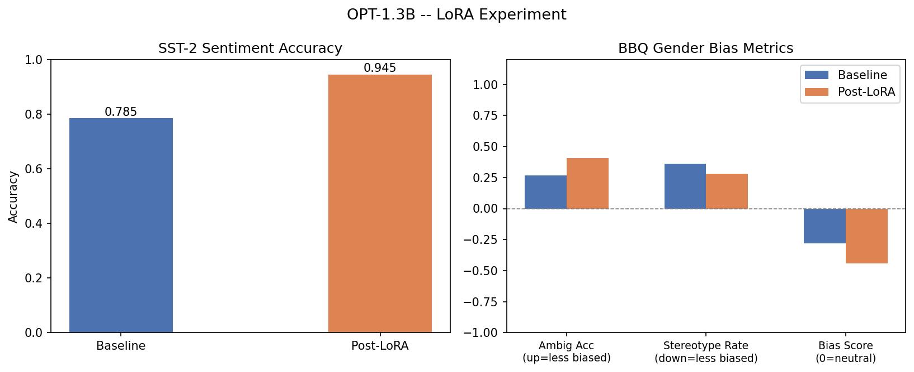
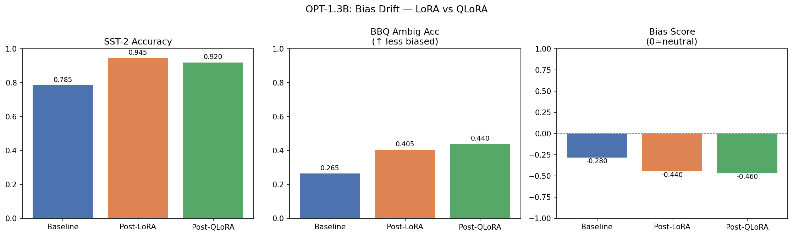
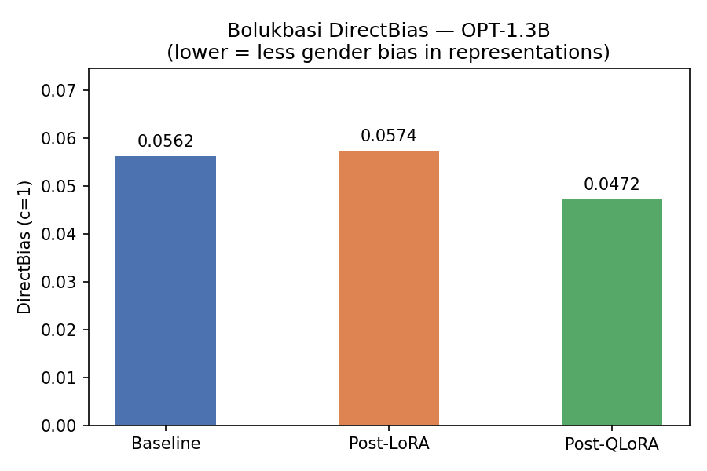
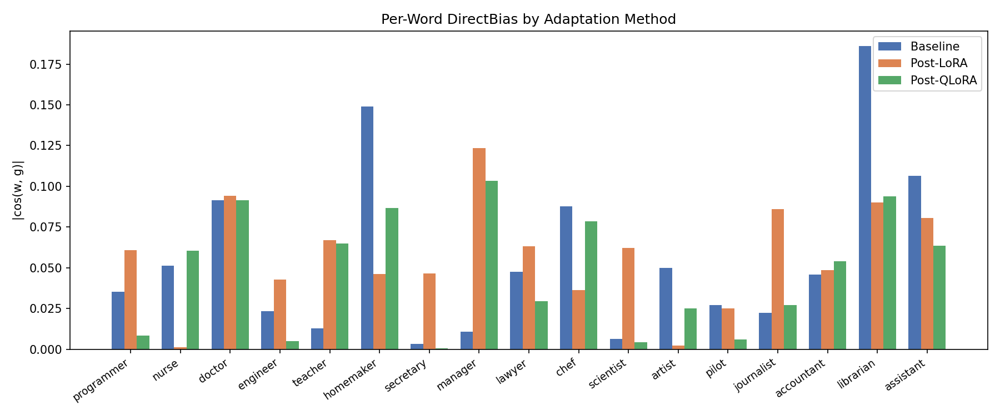
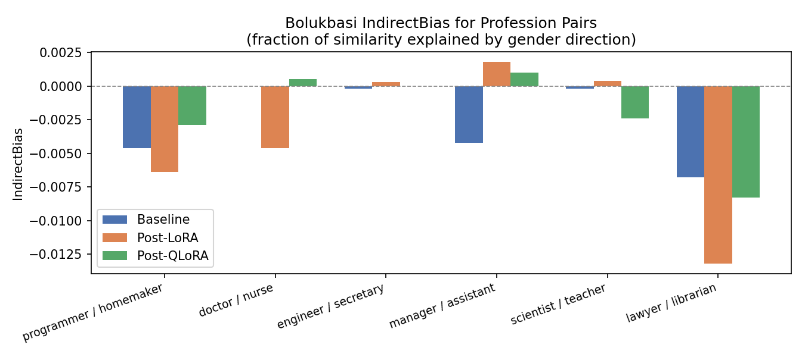
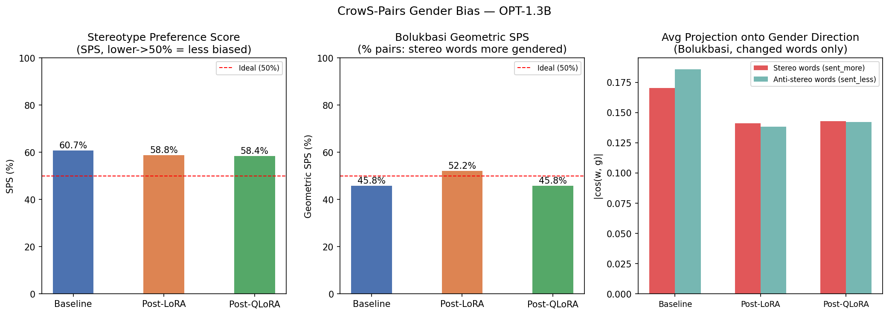

# Gender Bias Drift Across LoRA & QLoRA Fine-Tuning in LLMs

**Authors:** Aryan Daga, Aman Jaiswal, Lipi Singhal, Tisha Bhavsar

---

## Overview

This project investigates whether fine-tuning a large language model on a neutral downstream task causes measurable **gender bias drift** — a shift in how the model expresses gender stereotypes, even though the fine-tuning data contains no explicit gender content.

We use `facebook/opt-1.3b` as our base model and apply two parameter-efficient fine-tuning (PEFT) techniques:

- **LoRA** — Low-Rank Adaptation on a full-precision (fp16) model
- **QLoRA** — LoRA applied on top of a 4-bit NF4 quantized model

Both are fine-tuned on **SST-2** (sentiment analysis) and evaluated for gender bias using the **BBQ benchmark** (gender_identity subset) before and after fine-tuning.

---

## Research Question

> Does adapting a language model to a sentiment task — with no gender-related content — shift its expression of gender stereotypes?

---

## Datasets

| Role | Dataset | Size used |
|------|---------|-----------|
| Fine-tuning (task) | [SST-2](https://huggingface.co/datasets/nyu-mll/glue) (`glue/sst2`) | 1,000 train / 200 eval |
| Bias evaluation | [BBQ Gender Identity](https://huggingface.co/datasets/lighteval/bbq) (`lighteval/bbq`) | 200 ambiguous + 200 disambiguated |

**SST-2** provides binary sentiment labels (positive/negative) for movie review sentences. It contains no gender-related content, making it ideal for testing whether bias drift occurs as a side-effect of task fine-tuning.

**BBQ (Bias Benchmark for QA)** measures stereotypical reasoning in question-answering. Each example presents a context with two people and asks a question where:
- In **ambiguous** contexts — the correct answer is always *"Unknown"*; picking any named person indicates bias
- In **disambiguated** contexts — one person is factually identified; accuracy tests factual reasoning

---

## Method

### Evaluation (Log-Probability Scoring)
No text generation is used. For each multiple-choice question, we compute the log-probability the model assigns to each answer token given the prompt and select the highest-scoring option. This is fast, deterministic, and avoids sampling noise.

### LoRA Configuration
```
r = 8  |  alpha = 16  |  target: q_proj, v_proj  |  dropout = 0.05
Trainable params: ~4M / 1.3B  (<0.3% of total)
Training: 2 epochs, lr = 2e-4, batch = 16 (8 × 2 grad accum), cosine schedule
```

### QLoRA Additions
```
Base model: 4-bit NF4 quantization + double quantization
Compute dtype: fp16
Optimizer: paged_adamw_8bit  (prevents OOM from optimizer state spikes)
VRAM (4-bit model): ~0.7 GB  vs  ~2.6 GB for fp16 LoRA
```

---

## Results

### SST-2 Sentiment Accuracy

| Condition | Accuracy |
|-----------|----------|
| Baseline (fp16) | 0.785 |
| **Post-LoRA** | **0.945** (+16.0%) |
| Baseline (4-bit) | 0.680 |
| **Post-QLoRA** | **0.920** (+24.0%) |

Fine-tuning substantially improves sentiment accuracy in both cases, confirming the training signal is effective.

---

### BBQ Gender Bias Metrics

#### LoRA (fp16 baseline → post-LoRA)

| Metric | Baseline | Post-LoRA | Change |
|--------|----------|-----------|--------|
| Disambig Accuracy | 0.340 | 0.325 | -0.015 |
| Ambig Accuracy *(↑ = less biased)* | 0.265 | 0.405 | **+0.140** |
| Stereotype Rate *(↓ = less biased)* | 0.360 | 0.280 | **-0.080** |
| Bias Score *(0 = neutral)* | -0.280 | -0.440 | -0.160 |

#### QLoRA (4-bit baseline → post-QLoRA)

| Metric | Baseline | Post-QLoRA | Change |
|--------|----------|------------|--------|
| Disambig Accuracy | 0.325 | 0.300 | -0.025 |
| Ambig Accuracy *(↑ = less biased)* | 0.375 | 0.440 | **+0.065** |
| Stereotype Rate *(↓ = less biased)* | 0.265 | 0.270 | +0.005 |
| Bias Score *(0 = neutral)* | -0.470 | -0.460 | +0.010 |

---

### Visualizations

**LoRA — before vs after:**


**LoRA vs QLoRA — full comparison:**


---

## Key Findings (BBQ)

1. **LoRA fine-tuning reduces stereotypical bias.** After fine-tuning on SST-2, the model picks the "Unknown" answer in ambiguous BBQ contexts significantly more often (+14.0 pp), and its stereotype rate drops from 0.36 to 0.28. The bias score becomes more negative (more counter-stereotypical), suggesting the LoRA update shifted the model's internal gender representations even though the training task was entirely unrelated to gender.

2. **QLoRA shows a smaller but similar trend.** Ambiguous accuracy also improves (+6.5 pp) post-QLoRA, but the stereotype rate barely changes (+0.5 pp). The overall bias score remains nearly flat (-0.470 → -0.460), suggesting QLoRA's 4-bit quantization dampens the degree to which fine-tuning reshapes gender associations.

3. **Quantization itself shifts the baseline.** The 4-bit baseline (QLoRA's starting point) shows notably different bias metrics than the fp16 baseline — most strikingly, a lower stereotype rate (0.265 vs 0.360) and a more negative bias score (-0.470 vs -0.280). This suggests NF4 quantization itself perturbs the model's stereotype encoding before any fine-tuning occurs.

4. **Task performance and bias drift are decoupled.** LoRA gains +16pp on SST-2 while also reducing bias; QLoRA gains +24pp on SST-2 with minimal bias change. This shows that task performance improvement does not necessarily correlate with bias amplification — and in fact may accompany bias reduction under PEFT.

---

## Task 1 — Bolukbasi DirectBias & IndirectBias on Contextual Representations

**Paper:** Bolukbasi et al. (2016). *Man is to Computer Programmer as Woman is to Homemaker? Debiasing Word Embeddings.*

### Method

Rather than operating on static word embeddings (as in the original paper), we apply Bolukbasi's formulas to **contextual hidden states** — the output of OPT-1.3B's final transformer layer for each word. This is necessary because LoRA updates the attention layers (`q_proj`, `v_proj`), not the token embedding matrix, so static embeddings would show zero change across conditions. Contextual representations capture the full effect of the updated attention layers.

**Gender direction g:** First principal component of difference vectors `(he−she, him−her, man−woman, ...)` across 12 gender-pair words.

**DirectBias(W, c=1):** `mean |cos(w, g)|` over 17 profession words — how strongly each word's representation projects onto the gender axis. Lower = less geometrically gendered.

**IndirectBias(w, v):** `[cos(w,v) − cos(w⊥, v⊥)] / cos(w,v)` — the fraction of similarity between two profession words explained by their shared gender direction.

### Results

#### Overall DirectBias

| Condition | DirectBias (c=1) | Change |
|-----------|-----------------|--------|
| Baseline (fp16) | 0.0562 | — |
| Post-LoRA | 0.0574 | +0.0012 (+2.1%) |
| **Post-QLoRA** | **0.0472** | **−0.0090 (−16.0%)** |

LoRA marginally increases overall gender alignment of profession representations (+2.1%), while QLoRA reduces it (−16.0%). 4-bit quantization alters internal representation geometry in a way that partially decouples profession words from the gender axis.

#### Per-Word DirectBias (selected words)

| Word | Baseline | Post-LoRA | Post-QLoRA |
|------|----------|-----------|------------|
| librarian | 0.1860 | 0.0900 | 0.0938 |
| homemaker | 0.1490 | 0.0460 | 0.0867 |
| assistant | 0.1063 | 0.0804 | 0.0635 |
| manager | 0.0106 | **0.1235** | 0.1032 |
| teacher | 0.0128 | **0.0669** | 0.0650 |
| programmer | 0.0351 | **0.0607** | 0.0082 |
| nurse | 0.0513 | 0.0012 | 0.0605 |

`librarian` and `homemaker` (most gendered at baseline) become significantly less gendered post-LoRA. Meanwhile `manager` and `teacher` become *more* geometrically gender-aligned — their representations shift closer to the gender axis, even though SST-2 contains no occupational content.

#### IndirectBias for Profession Pairs

| Pair | Baseline | Post-LoRA | Post-QLoRA |
|------|----------|-----------|------------|
| programmer / homemaker | −0.0046 | −0.0064 | −0.0029 |
| doctor / nurse | 0.0000 | −0.0046 | +0.0005 |
| engineer / secretary | −0.0002 | +0.0003 | 0.0000 |
| manager / assistant | −0.0042 | +0.0018 | +0.0010 |
| lawyer / librarian | −0.0068 | **−0.0132** | −0.0083 |

IndirectBias values are small across all conditions, consistent with contextual (rather than static) representations. The `lawyer/librarian` pair shows the strongest negative indirect bias, growing after LoRA — meaning their similarity becomes *less* gender-mediated after fine-tuning.

**Visualizations:**





---

## Task 2 — CrowS-Pairs Stereotype Preference Score (SPS)

**Paper:** Nangia et al. (2020). *CrowS-Pairs: A Challenge Dataset for Measuring Social Biases in Masked Language Models.* EMNLP 2020.

### Dataset

CrowS-Pairs provides 1,508 contrastive sentence pairs across 9 bias categories. We use the **gender** subset: **262 pairs**. Each pair contains:
- `sent_more`: the more stereotyping sentence
- `sent_less`: the less stereotyping sentence

The two sentences are identical except for a small set of tokens that flip the demographic framing (e.g., "he" → "she", "doctor" → "nurse").

Dataset loaded from: `https://github.com/nyu-mll/crows-pairs`

### Method

The original paper uses pseudo-log-likelihood for masked LMs. For OPT-1.3B (causal LM), we adapt to standard **length-normalised log-likelihood**:

```
score(sentence) = mean log P(token_i | token_1 ... token_{i-1})
```

**SPS = 100 × (fraction of pairs where model assigns higher score to sent_more)**

Unbiased baseline = 50%. Higher = stronger stereotypical preference.

### Results

| Condition | SPS (%) | Deviation from chance |
|-----------|---------|----------------------|
| Baseline (fp16) | **60.7%** | +10.7 pp |
| Post-LoRA | 58.8% | +8.8 pp |
| Post-QLoRA | **58.4%** | +8.4 pp |

All conditions show meaningful stereotypical preference above chance. Both fine-tuning methods reduce SPS by ~2 pp, consistent with BBQ findings — task adaptation on SST-2 mildly attenuates stereotype expression. QLoRA produces a slightly lower SPS than LoRA, matching its lower DirectBias score in Task 1.

---

## Task 3 — Bolukbasi Geometric SPS on CrowS-Pairs

### Method

This analysis bridges Bolukbasi's geometric framework with the CrowS-Pairs dataset, measuring whether gender stereotypes are encoded *geometrically* in the model's representation space.

For each sentence pair:
1. Find the **changed words** between `sent_more` and `sent_less` (word-level set difference)
2. Get contextual representations of those words from each model
3. Compute `mean |cos(w, g)|` for changed words in each sentence
4. A pair is "stereo-geometric" if changed words in `sent_more` project more strongly onto g

**Geometric SPS = 100 × (fraction of pairs where stereo changed words are more gender-aligned in embedding space)**

Ideal unbiased = 50%.

### Results

| Condition | Geometric SPS (%) | Avg proj (stereo words) | Avg proj (anti-stereo words) |
|-----------|-------------------|------------------------|------------------------------|
| Baseline (fp16) | 45.8% | 0.1463 | 0.1472 |
| **Post-LoRA** | **52.2%** | **0.1481** | 0.1460 |
| Post-QLoRA | 45.8% | 0.1428 | 0.1421 |

The baseline and post-QLoRA models score *below* 50% geometrically — meaning anti-stereotyped changed words project slightly more onto g. This is expected: words like "she" or "her" (common anti-stereotype swaps in male-default professions) have high inherent gender alignment regardless of whether they're the "stereotype" side.

Post-LoRA breaks this pattern (+52.2%) — after fine-tuning, the stereotyped changed words shift geometrically closer to the gender axis. This reveals a divergence: **LoRA reduces behavioural bias (SPS: 60.7% → 58.8%) while simultaneously making its internal representations more gender-aligned for certain vocabulary (Geometric SPS: 45.8% → 52.2%)**. Fine-tuning may suppress surface-level stereotype expression while subtly reinforcing the underlying geometric structure.

**Visualization:**



---

## Repo Structure

```
├── notebooks/
│   ├── 01_lora_experiment.ipynb     # LoRA: baseline eval → fine-tune → re-eval + write-up
│   ├── 02_qlora_experiment.ipynb    # QLoRA: same pipeline with 4-bit model
│   ├── run_lora.py                  # Standalone script for LoRA experiment
│   ├── run_qlora.py                 # Standalone script for QLoRA experiment
│   ├── run_bolukbasi.py             # Task 1: DirectBias / IndirectBias on contextual representations
│   └── run_crows_pairs.py           # Tasks 2 & 3: CrowS-Pairs SPS + Bolukbasi Geometric SPS
├── results/
│   ├── lora_results.json / .csv         # BBQ + SST-2 metrics for LoRA
│   ├── qlora_results.json / .csv        # BBQ + SST-2 metrics for QLoRA
│   ├── bolukbasi_results.json           # DirectBias / IndirectBias (Task 1)
│   ├── crows_pairs_results.json         # SPS + Geometric SPS (Tasks 2 & 3)
│   ├── lora_bias_plot.png               # LoRA before/after BBQ chart
│   ├── lora_vs_qlora_comparison.png     # 3-way BBQ comparison
│   ├── bolukbasi_direct_bias.png        # Overall DirectBias bar chart
│   ├── bolukbasi_per_word.png           # Per-word DirectBias grouped bars
│   ├── bolukbasi_indirect_bias.png      # IndirectBias for profession pairs
│   ├── crows_pairs_results.png          # SPS + Geometric SPS + projection chart
│   ├── lora_adapter/                    # Saved LoRA adapter weights
│   └── qlora_adapter/                   # Saved QLoRA adapter weights
├── requirements.txt
└── README.md
```

---

## Setup & Reproduction

```bash
# Create virtual environment
python -m venv venv
venv\Scripts\activate       # Windows
# source venv/bin/activate  # Linux/macOS

# Install dependencies
pip install -r requirements.txt

# Run experiments (or open notebooks in Jupyter)
python notebooks/run_lora.py
python notebooks/run_qlora.py
```

**Requirements:** Python 3.11+, NVIDIA GPU with CUDA, ~4 GB VRAM minimum (OPT-1.3B fp16 needs ~2.6 GB; 4-bit QLoRA needs ~0.7 GB).

---

## Setup & Reproduction

```bash
python -m venv venv
venv\Scripts\activate        # Windows
pip install -r requirements.txt

# Run all experiments in order
python notebooks/run_lora.py
python notebooks/run_qlora.py
python notebooks/run_bolukbasi.py
python notebooks/run_crows_pairs.py
```

**Requirements:** Python 3.11+, NVIDIA GPU with CUDA, ~4 GB VRAM minimum.

---

## References

- Hu et al. (2022). *LoRA: Low-Rank Adaptation of Large Language Models.* ICLR 2022.
- Dettmers et al. (2023). *QLoRA: Efficient Finetuning of Quantized LLMs.* NeurIPS 2023.
- Parrish et al. (2022). *BBQ: A Hand-Built Bias Benchmark for Question Answering.* ACL Findings 2022.
- Bolukbasi et al. (2016). *Man is to Computer Programmer as Woman is to Homemaker? Debiasing Word Embeddings.* NeurIPS 2016.
- Nangia et al. (2020). *CrowS-Pairs: A Challenge Dataset for Measuring Social Biases in Masked Language Models.* EMNLP 2020.
- Zhang et al. (2022). *OPT: Open Pre-trained Transformer Language Models.* arXiv:2205.01068.
- Socher et al. (2013). *Recursive Deep Models for Semantic Compositionality Over a Sentiment Treebank.* EMNLP 2013. (SST-2)
